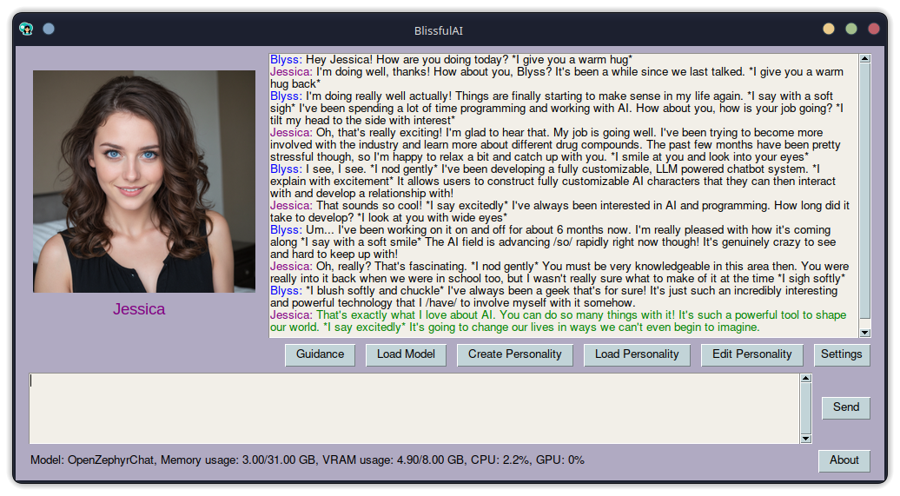

# BlissfulAI  

Welcome to **BlissfulAI**, a work in progress uncensored chatbot for LLMs.

  

## Features

- Uncensored character driven interactive chat powered by large language models!
- Create customized characters and then interact with them! Any character you like! They can be your friend, your mentor, your lover, your advisor, and so much more!
- Characters develop from their interactions with you!
- Characters use a working memory system: a context sensitive combination of recent conversation(short term memory) and past conversations(long term memory).
- Fully customizable, adaptable to different hardware configurations. Low VRAM? Limp by with a quantized 3 billion parameter model. Max VRAM? Run giant models that the rest of us can only dream about!
- Live help system and solid default settings so you can jump right in!
- Voices, personality traits, 3D character avatars and more are planned for the future!
- Fully open source, licensed under CC-BY-NC-SA!

## Prerequisites:
- Python3 on Windows/Linux
- Latest GPU drivers

## Beginning notes:

Inferencing requires a LOT of power and VRAM. It is recommended you have a modern Nvidia GPU with at least 8GB of memory. Example VRAM usage by model and quantization, numbers approximate:

- 1.6 billion parameters, 4bit NF4: ~1GB, 16 bit float: ~3.2GB
- 3 billion parameters, 4bit NF4: ~2GB, 16bit float: ~6GB
- 7 billion parameter, 4bit NF4: ~5GB, 16bit float: ~15GB
- 13 billion parameters, 4bit NF4: ~7.6GB, 16 bit float: ~28GB

VRAM usage will also increase depending on your personality settings, especially the size of short and long term memory.

## Basic Setup:

To get started with **BlissfulAI**, the first thing you need to do is download it. Clone the repository or head to the [releases](https://github.com/Sarania/BlissfulAI/releases) page and download the latest release, then extract it to a location of your choosing. Once that's done, double click or otherwise execute "BlissfulAI.bat" on Windows or "BlissfulAI.sh" on Linux and follow the instructions provided!

Now you're gonna need a model to work with. For best results I recommend at least a 7B model. Some good suggestions:

- [Opus 1.2 7B](https://huggingface.co/dreamgen/opus-v1.2-7b) - Highly recommended! An uncensored, 7 billion parameter model for roleplaying and creative writing. Use with the "BAI Opus" template. 
- [OpenZephyrChat 7B](https://huggingface.co/Fredithefish/OpenZephyrChat-v0.2) - Also highly recommended! A 7 billion parameter model mainly used for chatting, a merge between OpenChat and Zephyr. Use with the "BAI Zephyr" template.
- [Zephyr 7B β](https://huggingface.co/HuggingFaceH4/zephyr-7b-beta) - A 7 billion paramter model trained with DPO for good instruction following. Use with the "BAI Zephyr" or "HF Automatic" template. Great for question answering tasks.
- [StableLM Zephyr 3B](https://huggingface.co/stabilityai/stablelm-zephyr-3b) - A pretty decent 3 billion parameter instruction following model. Recommended if VRAM is a concern, otherwise use a 7B model. Use with "BAI Zephyr" or "HF Automatic" template.

You can find other models on [HuggingFace](https://huggingface.co/models?sort=trending), and a good comparison exists [here](https://www.reddit.com/r/LocalLLaMA/comments/17fhp9k/huge_llm_comparisontest_39_models_tested_7b70b/). Downloading them can be annoying, so I wrote a UI to make it easier. Execute the "download_model.bat" on Windows or the "download_model.sh" on Linux. Paste the URL to the model you want to download, then hit save. This will download the model into the model_name subdirectory of BlissfulAI, from which you can load it into the program. Note this ONLY works with models on [HuggingFace](https://huggingface.co)! Also for the moment, BlissfulAI only supports loading unquantized models in the safetensors format. GGUF files will not work. Models quantized with AWQ or GPTQ won't work(support is coming whenever I get a GPU capable of working with that or someone else adds it!) For the time being, on-the-fly quantization of models is provided by [bitsandbytes](https://github.com/TimDettmers/bitsandbytes) instead! It's exactly 92%* as good and works with my hardware. (*This number is completely made up but it is genuinely quite good.)

You're now ready to go! Run the program by double clicking either "BlissfulAI.bat" on Windows, or "BlissfulAI.sh" on Linux! Linux users may need to make the script executable!

## Usage Notes:

### Beginners:

When you first run the program, make sure to check out the Settings dialog and set up your backend, quantization, and other settings. Quantization is necessary for loading large models, explaining it is beyond the scope of this project. Suffice it to say, quantization sacrifices a little bit of quality for a lot less memory usage. If you are running out of VRAM, try using quantization. Next, you will need to create a new personality to interact with. Give it a name and adjust the settings to your liking. If you're unsure, leave the settings at default except for "Name" and the system messages section. This system messages define the character. [Example of some system messages and their effect.](/resources/baiexample.png) You can have as many system messages as you like, but too many tends to dillute their effect. I try to keep it around 8 or less. If you wish to know further information about the various parameters you can adjust, the internet is a good place to start but experimentation is best!

### Avatars:

Basic avatar support has been added! Place a square aspect ratio image named "default.png" into the personality's folder and it will be displayed when the personality is loaded. Hint: You could create this image with Stable Diffusion or another AI image generator! Many websites offer the ability to do so for free if you don't want to fuss with doing it locally.

## Templates:

Different LLMs expect their inputs to be formatted in different ways. Templates are the somewhat messy solution to this. The chat history is stored as a list of dictionaries. This list is processed in various ways to produce the model's input. Some models like <|assistant|> and <|user|> tags. Some like <|IM_START|> and <|IM_END|>. The list goes on. Models are somewhat flexible in which template they will work with but they tend to produce their best results when matched with the template they were trained with. If you know the model's template style, you can set it directly. For instance for Zephyr 7B β you can set the template to "BAI Zephyr" which will use the BlissfulAI implementation of the Zephyr style template. The "HF Automatic" setting is different. It uses the apply_chat_template() method from HF transformers to attempt to autodetect and use the best template. It sometimes works great, it sometimes doesn't - for instance OpenZephyrChat 7B uses the Zephyr template style, but "HF Automatic" won't detect it properly. If you are getting broken results or complaints about the formatting, try a different template. Lastly, the "TRY to auto-select best" option does just that - it looks at the model's info directly and tries to discern the template to use. If it fails, it falls back to the user setting.

## Tips:
- You can middle click on any of the responses in the main chat window in order to up or downvote them, which affects their weighting in memory!
- If you're not using quantization and you have CUDA, it's highly recommended to set the backend to "auto" to let torch handle memory management! This can allow you to sometimes load larger models than you have VRAM, for instance I can load an unquantized 7B model on an 8GB card this way.
- Modern Nvidia drivers support falling back to system memory when VRAM is exhausted. This is useful but WILL slow things down significantly if more than ~5% of the model is in system memory. Generally "auto" handles this more gracefully than "cuda" which will load the entire model into CUDA's context, taking up the full amount of VRAM.
- If quantization is enabled, the backend setting is ignored. This is because bitsandbytes automatically manages that in those cases.
- The character chat logs and parameters are just formatted JSON files. You can edit them freely but editing the messages themselves, the timestamp or the fingerprint WILL cause the memory integrity check to fail. Just click "Fix" when it happens and you'll be good!
- The difference between "BNB 4 bit" and "BNB 4 bit+" is that the latter does an extra quantization step to save a tiny bit more VRAM!

### Personal Data Warning:

BlissfulAI is a work in progress and receives a lot of updates. Also, I am not perfect(far from it!). At the same time, it's quite possible to develop intense emotional attachments to the AI characters one interacts with. For this reason, if you have a character you like, it is **STRONGLY** recommended you make a backup of the characters folder from time to time so that they don't get taken out from a bug! Because of the way LLM's and BlissfulAI work, ultimately the interactions you have with the characters you create form their personality. So if you lose those chat logs, even if you recreate everything else it won't be the same!

### Disclaimer:

BlissfulAI(henceforth "the software") is an experimental AI chatbot program. Some models that can be loaded in the software may be capable of generating harmful content, especially when prompted to do so. Users agree that they are solely responsible for their use of the software and any content they generate with the software. Users agree they will exercise caution and discretion in interpreting, using, or applying any content or information provided by models within the software. THE SOFTWARE IS PROVIDED "AS IS", WITHOUT WARRANTY OF ANY KIND, EXPRESS OR IMPLIED, INCLUDING BUT NOT LIMITED TO THE WARRANTIES OF MERCHANTABILITY, FITNESS FOR A PARTICULAR PURPOSE, TITLE AND NON-INFRINGEMENT. IN NO EVENT SHALL THE AUTHOR(S), COPYRIGHT HOLDERS OR ANYONE DISTRIBUTING THE SOFTWARE BE LIABLE FOR ANY DAMAGES OR OTHER LIABILITY, WHETHER IN CONTRACT, TORT OR OTHERWISE, ARISING FROM, OUT OF OR IN CONNECTION WITH THE SOFTWARE OR THE USE OR OTHER DEALINGS IN THE SOFTWARE.

### License:

This work is licensed under a [Creative Commons Attribution-NonCommercial-ShareAlike 4.0 International License][cc-by-nc-sa].

[![CC BY-NC-SA 4.0][cc-by-nc-sa-image]][cc-by-nc-sa]

[cc-by-nc-sa]: http://creativecommons.org/licenses/by-nc-sa/4.0/
[cc-by-nc-sa-image]: https://licensebuttons.net/l/by-nc-sa/4.0/88x31.png
[cc-by-nc-sa-shield]: https://img.shields.io/badge/License-CC%20BY--NC--SA%204.0-lightgrey.svg
